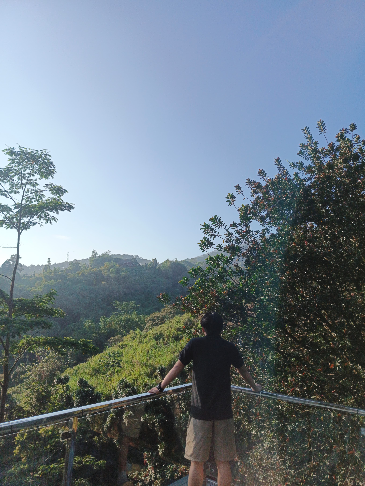

<!doctype html>

<html lang="en">
   
   
    <head>
       
       
        <!-- META -->
        <meta charset="utf-8">
        <meta name="robots" content="noodp">
        <meta name="viewport" content="width=device-width, initial-scale=1, maximum-scale=1, user-scalable=no">
       
        <!-- PAGE TITLE -->
        <title>Fanico Adrian / D </title>
       
        <!-- FAVICON -->
        <link rel="shortcut icon" href="assets/img/favicon.png">
       
        <!-- FONTS -->
        <link href="file:///E:/document/assets/fonts/FontAwesome" rel="stylesheet">
       
        <!-- STYLESHEETS -->
        <link rel="stylesheet" type="text/css" href="assets/css/plugins.css">
        <link rel="stylesheet" type="text/css" href="assets/css/main.css">
        
        
    </head>

   
    <body>
    
    
        <!-- PRELOADER -->
        

           
            

            
        

        <!-- /PRELOADER -->
    
        <!-- IMAGE CONTAINER -->
        

           
            

        

        <!-- /IMAGE CONTAINER -->

        <!-- CONTENT AREA -->
        

            <!-- CONTENT AREA INNER --> 
            

                <!-- INTRO -->
                <section id="intro">

                    <!-- CONTAINER MID -->
                    

                       
                        <!-- ANIMATION CONTAINER -->
                        

                        
                           <b> <h1>I’m Fanico Adrian P</h1></b>
                            <h2>Leader Divisi</h2>
                        
                        

                        <!-- /ANIMATION CONTAINER -->
                        
                        
                        <!-- ANIMATION CONTAINER -->
                        

                           
                            
saya adalah seorang yang sedang membutuhkan segelas kopi dan kursi indomaret

                            
                        

                        <!-- /ANIMATION CONTAINER -->
                        
                        
                        <!-- ANIMATION CONTAINER -->
                        

                           
                            <a href="#about" class="smooth-scroll">Info lebih Lanjut.<i class="fa fa-angle-down" aria-hidden="true"></i></a>
                            
                        

                        <!-- /ANIMATION CONTAINER -->

                    

                    <!-- /CONTAINER MID -->

                </section>
                <!-- /INTRO -->

                <!-- ABOUT -->
                <section id="about">

                    <h3 class="headline scroll-animated-from-right">Sedikit Biodata tentang Diri Saya</h3>
                    
                    
Fanico Adrian Pradana ( Nico ) Kelahiran Tahun 2023 , Memiliki Ketertarikan Terhadapa Bidang Seperti Programming dan Otomotif , Bekerja Sebagai Leader Divisi di Perusahaan PT. CITRA SUMBER NUSANTARA . 

                    <h2>Quotes</h2>
                    
 “Jangan biarkan kegagalan kemarin menghentikan kesuksesan hari ini.”

                    
  “Bangunlah setiap pagi dengan tekad untuk menjadi yang terbaik.”

                    
“Jangan pernah menyerah pada impianmu. Mulai hari ini dan teruslah berjuang.”

                </section>
                <!-- /ABOUT -->
                
                
                <!-- SERVICE -->
                <section id="service">

                    <h4 class="headline scroll-animated-from-right">Keahlian di beberapa bidang</h4>
                    
                    
                    <!-- SERVICE LIST -->
                    <ul class="services-list">
                       
                       
                        <li class="scroll-animated-from-right"><i class="fa fa-gamepad" aria-hidden="true"></i>Game</li>
                        <li class="scroll-animated-from-right"><i class="fa fa-gamepad" aria-hidden="true"></i>Negosiasi</li>
                        <li class="scroll-animated-from-right"><i class="fa fa-cog" aria-hidden="true"></i>Otomotif</li>
                        
                    </ul>
                    <!-- /SERVICE LIST -->

                </section>
                <!-- /SERVICE -->
                
                
                <!-- WORK -->
                <section id="work">

                    <h3 class="headline scroll-animated-from-right">Hobi Saya</h3>
                    
                    
                    <!-- SHOWCASE -->
                    

                       
                       
                        <!-- ITEM -->
                        

                          
                          
                            <!-- LIGHTBOX LINK -->
                            <a href="#" data-featherlight="#item-1-lightbox">
                            
                            
                                <!-- INFO -->
                                

                                    <!-- CONTAINER MID -->
                                    

                                        <h5>GAMMERS</h5>
                                        
Gammers

                                    

                                    <!-- /CONTAINER MID -->

                                

                                <!-- /INFO -->

                                

                           
                            </a>
                            <!-- /LIGHTBOX LINK -->
                            
                            
                            <!-- LIGHTBOX -->
                            

                               
                               
                                
                                
                                <h3>Gammers</h3>
                                
Mobile legend/call of duty/ clash of clan/ashpalt 8

                                
                                
Untuk info Permabar an bisa chat atau dm di kontak yang sudah di sediakan.

                                
                                
                            

                            <!-- /LIGHTBOX -->
                            
                            
                        

                        <!-- /ITEM -->
                        
                        
                        <!-- ITEM -->
                        

                          
                          
                            <!-- LIGHTBOX LINK -->
                            <a href="#" data-featherlight="#item-2-lightbox">
                            
                            
                                <!-- INFO -->
                                

                                    <!-- CONTAINER MID -->
                                    

                                        <h5>Basketball</h5>

                                    

                                    <!-- /CONTAINER MID -->

                                

                                <!-- /INFO -->

                                

                           
                            </a>
                            <!-- /LIGHTBOX LINK -->
                            
                            
                            <!-- LIGHTBOX -->
                            

                               
                               
                                
                                
                                <h3>Basketball</h3>
                                
                                
Gak jago , cuman bisa aja hehe

                                
                                
                            

                            <!-- /LIGHTBOX -->
                            
                            
                        

                        <!-- /ITEM -->
                        
                        
                        <!-- ITEM -->
                        

                          
                          
                            <!-- LIGHTBOX LINK -->
                            <a href="#" data-featherlight="#item-3-lightbox">
                            
                            
                                <!-- INFO -->
                                

                                    <!-- CONTAINER MID -->
                                    

                                        <h5>bekerja &amp; bekerja</h5>

                                    

                                    <!-- /CONTAINER MID -->

                                

                                <!-- /INFO -->

                                

                           
                            </a>
                            <!-- /LIGHTBOX LINK -->
                            
                            
                            <!-- LIGHTBOX -->
                            

                               
                               
                                
                                
                                <h3>Bekerja &amp; Bekerja</h3>
                                
                                
Sebenernya bukan hobi si melainkan kewajiban, cuman karna sering di lakuin aja jadi hobi

                                
                                
                            

                            <!-- /LIGHTBOX -->
                            
                            
                        

                        <!-- /ITEM -->
                        
                        
                        <!-- ITEM -->
                        

                          
                          
                            <!-- LIGHTBOX LINK -->
                            <a href="#" data-featherlight="#item-4-lightbox">
                            
                            
                                <!-- INFO -->
                                

                                    <!-- CONTAINER MID -->
                                    

                                        <h5>Liburan ( Healing)</h5>
                                        
Healing

                                    

                                    <!-- /CONTAINER MID -->

                                

                                <!-- /INFO -->

                                

                           
                            </a>
                            <!-- /LIGHTBOX LINK -->
                            
                            
                            <!-- LIGHTBOX -->
                            

                               
                               
                                
                                
                                <h3>Liburan (Healing)</h3>
                                
Healing

                                
                                
Karna tadi hobinya kerja , saya juga butuh liburan biar ga stres"amat.

                                
                                
                            

                            <!-- /LIGHTBOX -->
                            
                            
                        

                        <!-- /ITEM -->
                        
                        
                    

                    <!-- /SHOWCASE -->

                </section>
                <!-- /WORK -->
                
                
                <!-- CONTACT -->
                <section id="contact">

                    <h3 class="headline scroll-animated-from-right">Kontak Saya.</h3>
                    
                    
                    <!-- CONTACT LIST -->
                    <ul class="contact-list">
                       
                        <li class="scroll-animated-from-right"><i class="fa fa-mobile" aria-hidden="true"></i>0881-0254-71806</li>
                        <li class="scroll-animated-from-right"><i class="fa fa-envelope-o" aria-hidden="true"></i>fanicoadrian@gmail.com</li>
                        
                    </ul>
                    <!-- /CONTACT LIST -->
                    
                    
                    <!-- CONTACT FORM --> 
                    <form id="contact-form" action="assets/php/contact.php" method="post">

                       
                        <input id="contact-form-name" type="text" name="name" class="form-control scroll-animated-from-right" placeholder="* Your Name">
                        
                        <input id="contact-form-email" type="text" name="email" class="form-control scroll-animated-from-right" placeholder="* Your Email">
                        
                        <!-- PHANTOM ELEMENT ( HONEYPOT CAPTCHA FOR SECURITY ) -->
                        
<input id="contact-form-company" type="text" name="company" class="form-control">

                        <!-- /PHANTOM ELEMENT ( HONEYPOT CAPTCHA FOR SECURITY ) -->
                        
                        <textarea id="contact-form-message" name="message" class="form-control scroll-animated-from-right" placeholder="* Your Message"></textarea>
                        
                        <button type="submit" class="form-control scroll-animated-from-right">Send Mail</button>
                        
                        
* The Email was Sent Successfully!

                   
                    </form>
                    <!-- /CONTACT FORM --> 

                </section>
                <!-- /CONTACT -->
                
                
                <!-- FOOTER -->
                <section id="footer">
                
                   
                    <!-- SOCIAL ICONS -->
                    <ul class="social-icons scroll-animated-from-right">
                       
                       
                        <li><a href="https://www.facebook.com/nitha.ajjhe?mibextid=rS40aB7S9Ucbxw6v"><i class="fa fa-facebook" aria-hidden="true"></i></a></li>
                        <li><a href="#"><i class="fa fa-twitter" aria-hidden="true"></i></a></li>
                        <li><a href="https://wa.me/0881025471806"><i class="fa fa-whatsapp" aria-hidden="true"></i></a></li>
                        <li><a href="#"><i class="fa fa-envelope-o" aria-hidden="true"></i></a></li>
                        
                        
                    </ul>
                    <!-- /SOCIAL ICONS -->
                    

                    
© 2023 Your Brand | Design by <a href="https://fanicoadrian@gmail.com">Fanicoadrian</a>

                </section>
                <!-- /FOOTER -->

            

            <!-- /CONTENT AREA INNER -->

        

        <!-- /CONTENT AREA -->
        
        
        <!-- JAVASCRIPTS -->
        
        
   
   
    </body> 
    
    
</html>
